# 🚀 Task Manager App

> **Transform your productivity with the ultimate Task Management experience!**

A modern, feature-rich Task Management application built with React Native and Expo that revolutionizes how you organize tasks, manage projects, and collaborate with teams. Experience seamless productivity with our beautiful, responsive UI and powerful features designed for the modern professional.

---

## ✨ Why Choose This Task Manager?

### 🎯 **Built for Real Productivity**

- **Smart Dashboard** - Get instant insights into your productivity with beautiful statistics and progress tracking
- **Intelligent Search** - Find anything instantly with our advanced search, filters, and smart suggestions
- **Offline-First** - Never lose your work! Work seamlessly even without internet connection
- **Real-time Sync** - Your data stays updated across all devices automatically

### 🏆 **Professional Features**

- **Team Collaboration** - Manage teams, assign tasks, and track progress together
- **Project Organization** - Organize tasks into projects with context-based management
- **Smart Notifications** - Stay on top of deadlines with intelligent notification system
- **Data Export/Import** - Full control over your data with easy backup and restore

---

## 🚀 Features

### 🔐 **Security & Authentication**

- **Secure Login/Register** — Enterprise-grade authentication with password recovery
- **Profile Management** — Complete account control with privacy and export settings
- **Data Protection** — Your data is safe with local storage and secure sync

### 🏠 **Smart Dashboard**

- **Productivity Analytics** — Beautiful charts and statistics to track your progress
- **Quick Actions** — One-tap access to frequently used features
- **Recent Activity** — Stay updated with your latest tasks and changes
- **Progress Tracking** — Visual progress indicators for all your projects

### 🔔 **Intelligent Notifications**

- **Real-time Alerts** — Instant notifications for deadlines and updates
- **Smart Reminders** — Never miss important tasks with intelligent scheduling
- **Push Notifications** — Stay connected even when app is closed
- **Customizable Settings** — Control what and when you want to be notified

### 📶 **Offline-First Design**

- **Work Anywhere** — Full functionality without internet connection
- **Smart Sync** — Automatic data synchronization when connection returns
- **Conflict Resolution** — Intelligent handling of data conflicts
- **Sync Status** — Always know your data status with clear indicators

### 🔎 **Advanced Search & Discovery**

- **Global Search** — Find tasks, projects, or notes instantly
- **Smart Filters** — Filter by status, priority, date, or custom criteria
- **Search History** — Quick access to recent searches
- **Smart Suggestions** — AI-powered search suggestions for faster discovery

### 📱 **Task & Project Management**

- **Intuitive Task Creation** — Create tasks with rich details and attachments
- **Project Organization** — Group tasks into logical projects and categories
- **Team Collaboration** — Assign tasks, share projects, and track team progress
- **Progress Visualization** — Beautiful charts and progress bars

### 🎨 **Modern UI/UX**

- **Responsive Design** — Perfect experience on phones, tablets, and web
- **Dark/Light Themes** — Choose your preferred visual style
- **Smooth Animations** — Delightful interactions and transitions
- **Accessibility** — Designed for users of all abilities

---

## 📸 Screenshots

### 🏠 Main App Screens

| Dashboard                                      | Profile                                     | Search & Filters                          |
| ---------------------------------------------- | ------------------------------------------- | ----------------------------------------- |
|  | 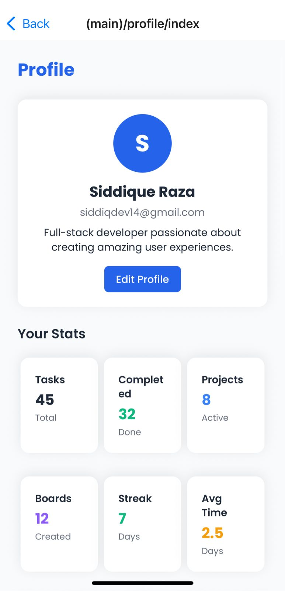 | 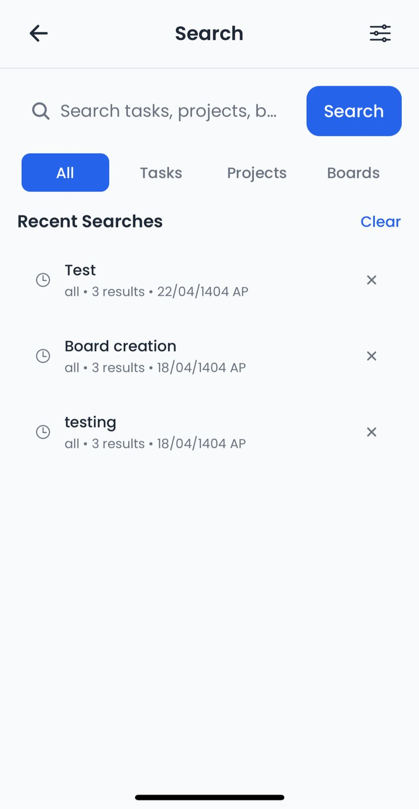 |

### 🔐 Authentication & Onboarding

| Login                                   | Register                                      | Navigation                                        |
| --------------------------------------- | --------------------------------------------- | ------------------------------------------------- |
| 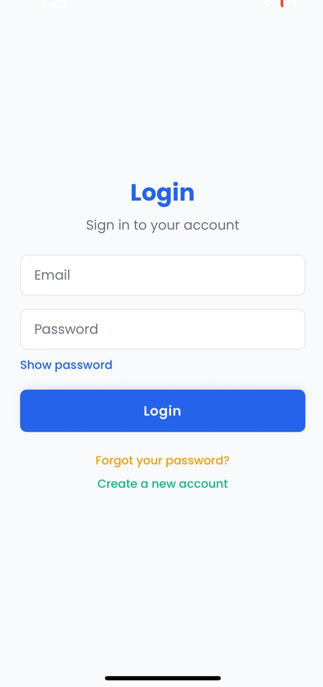 | 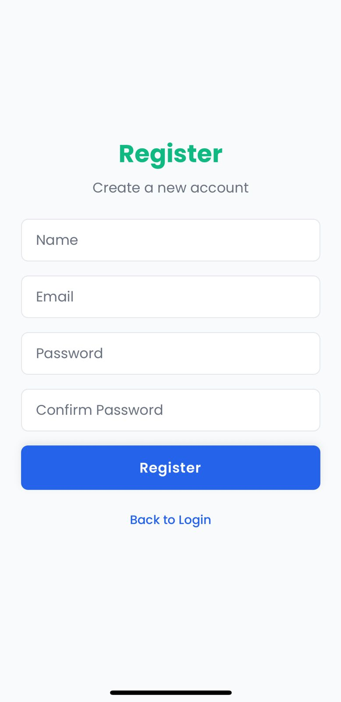 | 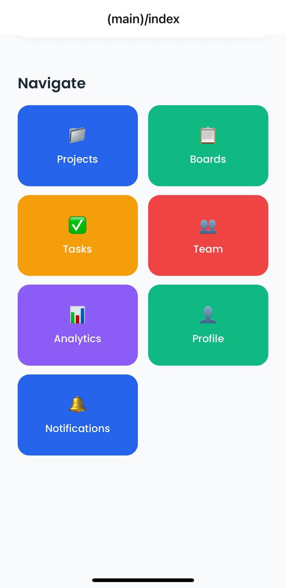 |

### 🔔 Notifications & Settings

| Notifications                                           | Settings                                      | Project View                                          |
| ------------------------------------------------------- | --------------------------------------------- | ----------------------------------------------------- |
| 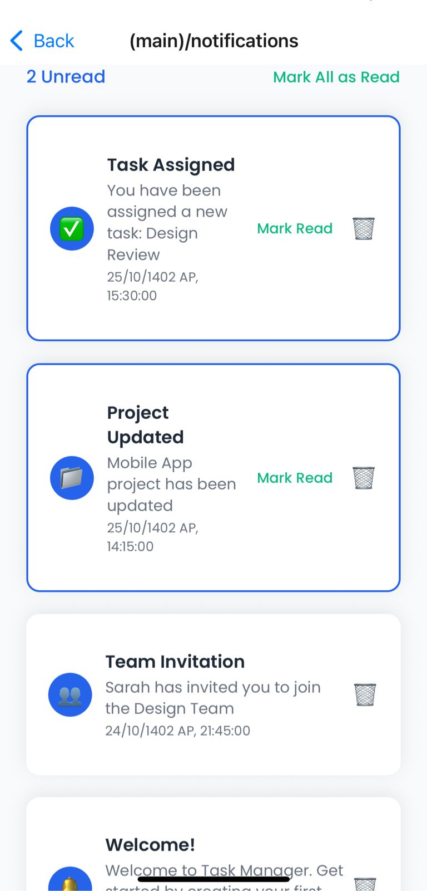 | 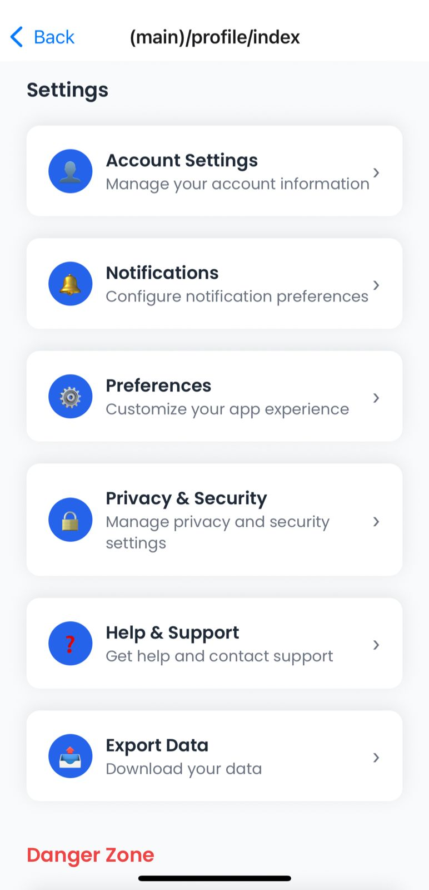 | 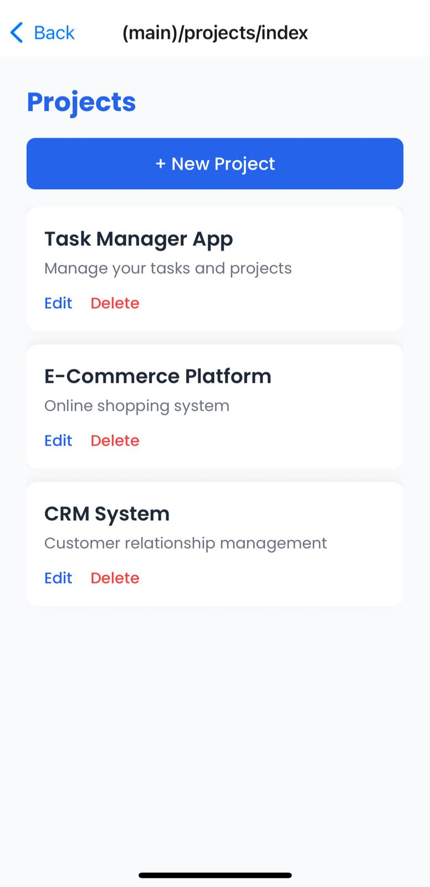 |

### 📱 Task Management

| Task Creation                                           | Team Management                                             | Analytics                                       |
| ------------------------------------------------------- | ----------------------------------------------------------- | ----------------------------------------------- |
| 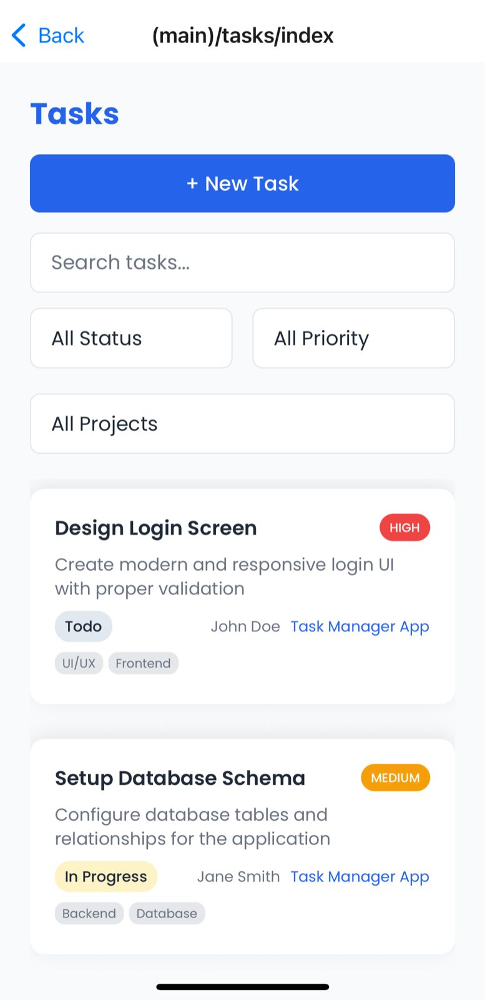 | 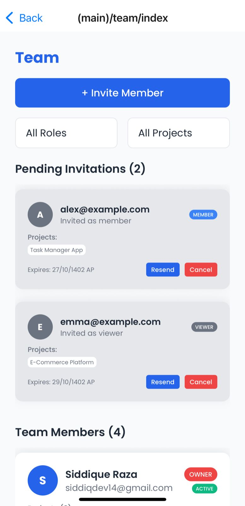 | 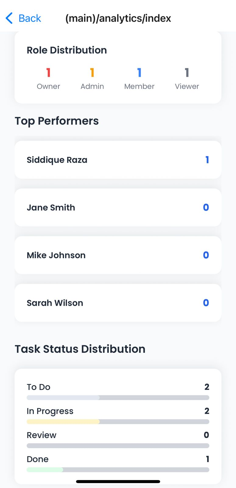 |

### 🎨 Additional Features

| Analytics 2                                              | Export/Import                                           | Dashboard                                      |
| -------------------------------------------------------- | ------------------------------------------------------- | ---------------------------------------------- |
| 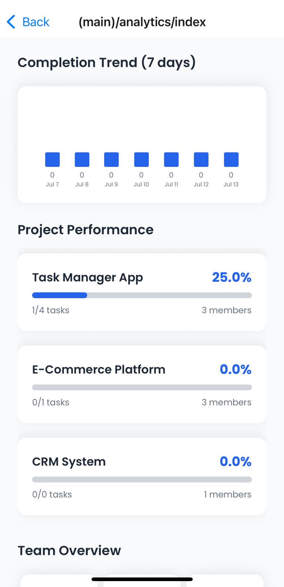 | 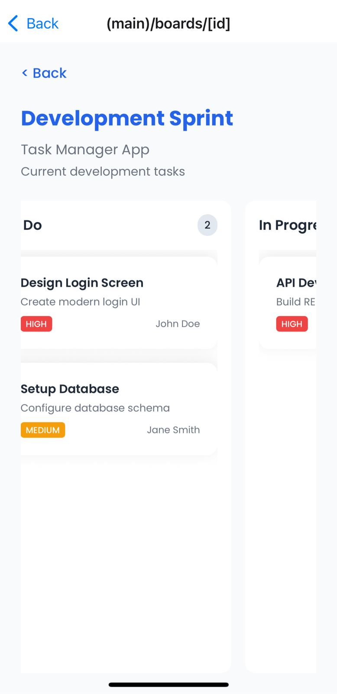 |  |

> _Experience the beautiful, intuitive interface that makes task management a pleasure!_

---

## 🛠️ Tech Stack

### **Frontend & Mobile**

- **React Native** — Cross-platform mobile development
- **Expo** — Rapid development and easy deployment
- **TypeScript** — Type-safe, maintainable code
- **Expo Router** — File-based navigation system

### **State Management & Data**

- **React Context API** — Efficient state management
- **AsyncStorage** — Local data persistence
- **NetInfo** — Network status monitoring
- **Custom Hooks** — Reusable business logic

### **UI/UX & Design**

- **Custom Components** — Beautiful, consistent UI elements
- **Responsive Design** — Works perfectly on all screen sizes
- **Modern Animations** — Smooth, delightful interactions
- **Accessibility** — Inclusive design for all users

### **Performance & Reliability**

- **Offline Support** — Works without internet connection
- **Data Sync** — Intelligent conflict resolution
- **Memory Optimization** — Efficient resource usage
- **Error Handling** — Graceful error recovery

---

## ⚡ Getting Started

### 🚀 **Quick Start (5 minutes)**

1. **Clone the repository:**

   ```bash
   git clone https://github.com/Siddiquedev14/task-manager-app.git
   cd task-manager-app
   ```

2. **Install dependencies:**

   ```bash
   npm install
   # or
   yarn install
   ```

3. **Start the development server:**

   ```bash
   npm start
   # or
   yarn start
   ```

4. **Run on your device:**
   - **Android:** Press `a` in terminal
   - **iOS:** Press `i` in terminal
   - **Web:** Press `w` in terminal
   - **QR Code:** Scan with Expo Go app

### 📱 **Mobile Setup**

- Install **Expo Go** app from App Store/Play Store
- Scan QR code from terminal
- Start using the app instantly!

### 🌐 **Web Setup**

- Open browser at `http://localhost:8081`
- Full web experience with responsive design

---

## 📂 Project Structure

```
task-manager-app/
├── App/                    # Main application screens
│   ├── (auth)/            # Authentication screens
│   │   ├── login.tsx      # Login screen
│   │   ├── register.tsx   # Registration screen
│   │   └── forgot.tsx     # Password recovery
│   └── (main)/            # Main app screens
│       ├── dashboard.tsx  # Dashboard with stats
│       ├── profile.tsx    # User profile
│       ├── search.tsx     # Search & filters
│       └── notifications.tsx # Notification center
├── components/            # Reusable UI components
│   ├── ui/               # Basic UI elements
│   └── features/         # Feature-specific components
├── contexts/             # React Context providers
│   ├── AuthContext.tsx   # Authentication state
│   ├── NotificationContext.tsx # Notifications
│   └── OfflineContext.tsx # Offline status
├── theme/                # Design system
│   ├── colors.ts         # Color palette
│   ├── typography.ts     # Font styles
│   └── spacing.ts        # Layout spacing
├── assets/               # Images and static files
│   └── screenshots/      # App screenshots
└── README.md            # This file
```

---

## 🎯 Use Cases

### 👤 **For Individuals**

- **Personal Task Management** — Organize daily tasks and goals
- **Project Planning** — Plan and track personal projects
- **Habit Tracking** — Build and maintain positive habits
- **Goal Setting** — Set and achieve personal goals

### 👥 **For Teams**

- **Team Collaboration** — Assign and track team tasks
- **Project Management** — Manage complex projects with multiple stakeholders
- **Progress Tracking** — Monitor team productivity and progress
- **Communication** — Centralized task communication

### 🏢 **For Organizations**

- **Workflow Management** — Streamline business processes
- **Resource Allocation** — Optimize team resource usage
- **Performance Monitoring** — Track team and individual performance
- **Data Analytics** — Gain insights into productivity patterns

---

## 🌟 What Makes This App Special?

### 💡 **Innovation**

- **Offline-First Architecture** — Works without internet, syncs when connected
- **Smart Search** — AI-powered search with suggestions and filters
- **Real-time Collaboration** — Live updates across all team members
- **Adaptive UI** — Automatically adjusts to your usage patterns

### 🎨 **Design Excellence**

- **Modern Aesthetics** — Beautiful, clean interface design
- **Intuitive Navigation** — Easy-to-use, logical user flow
- **Responsive Layout** — Perfect experience on any device
- **Accessibility** — Designed for users of all abilities

### ⚡ **Performance**

- **Lightning Fast** — Optimized for speed and responsiveness
- **Memory Efficient** — Minimal resource usage
- **Battery Friendly** — Optimized for mobile battery life
- **Scalable** — Handles large datasets efficiently

---

## 🤝 Contributing

We welcome contributions from the community! Here's how you can help:

### 🐛 **Report Bugs**

- Open an issue with detailed bug description
- Include steps to reproduce the problem
- Add screenshots if applicable

### 💡 **Suggest Features**

- Share your ideas for new features
- Describe the use case and benefits
- Help prioritize feature development

### 🔧 **Code Contributions**

- Fork the repository
- Create a feature branch
- Make your changes
- Submit a pull request

### 📝 **Documentation**

- Improve README and documentation
- Add code comments and examples
- Create tutorials and guides

---

## 📄 License

This project is licensed under the MIT License - see the [LICENSE](LICENSE) file for details.

---

## 🙋‍♂️ Support & Contact

### 📧 **Get Help**

- **GitHub Issues** — [Report bugs or request features](https://github.com/Siddiquedev14/task-manager-app/issues)
- **Discussions** — [Join community discussions](https://github.com/Siddiquedev14/task-manager-app/discussions)
- **Documentation** — [Read the docs](https://github.com/Siddiquedev14/task-manager-app/wiki)

### 🌟 **Show Your Support**

- **Star the repo** — If you find this project helpful
- **Share with friends** — Spread the word about this amazing app
- **Follow updates** — Watch the repository for new features

### 📱 **Stay Connected**

- **GitHub** — [@Siddiquedev14](https://github.com/Siddiquedev14)
- **Updates** — Watch this repository for latest features
- **Community** — Join our growing user community

---

## 🎉 **Ready to Transform Your Productivity?**

**Start using the Task Manager App today and experience the difference!**

> _"The best productivity tool is the one you actually use. This app makes task management so intuitive and enjoyable that you'll want to use it every day."_

**🚀 Get Started Now →** Clone this repository and begin your productivity journey!
